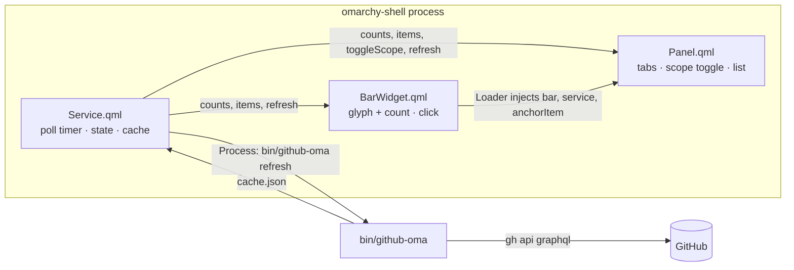

# Plan — `tenzin.github-oma`: GitHub issues & PRs in the Omarchy bar

Bar widget + popout panel that lists the open issues and pull requests you have
across your personal repos, with one button that folds organizations in too.

Every fact below is checked against the live install on this machine
(Omarchy shell at `/home/tenzin/omarchy`, `gh` 2.102.0, account
`yesheytenzin`, one org `acme-corp`).

## 1. What it shows

- **Item set** = open issues / open PRs that *involve* you
  (`involves:@me` — authored, assigned, mentioned, or your review requested),
  scoped to repos by owner.
- **Scopes**:
  - `mine` — `user:yesheytenzin` (66 owner repos today)
  - `orgs` — one search per org login (`org:acme-corp` today);
    org logins discovered automatically from `gh api user/orgs` +
    `gh api 'user/repos?affiliation=organization_member'` (catches orgs whose
    membership is private).
- **Toggle** in the panel: `Personal` ⇄ `Personal + Orgs` — the requested
  button; applies to both issues and PRs and persists across restarts.
- **Tabs**: `Issues` and `Pull requests`, each with a live count.
- Non-goals (v1): writing to GitHub, closed items, CI status, repos view,
  collaborator-owned repos outside your orgs (that category is easy to add
  later as a third scope: one extra search field).

Live sample (verified now): personal scope `6` items, org scope `22` items.

Prior art to be aware of, both *not* the same thing:
[eaescob/omarchy-github-bar](https://github.com/eaescob/omarchy-github-bar)
(repos + PRs + issues, no org toggle, no background polling) and
[sebday/omarchy-github](https://github.com/sebday/omarchy-github)
(contribution stats).

## 2. Decisions

| Decision | Choice | Why |
|---|---|---|
| Plugin kinds | `service` + `bar-widget` | One poller for the whole shell; every bar widget instance (one per monitor) just reads it. Without the service each monitor polls `gh` separately. Same shape as `omarchy.media` and `pnkm0nk.omodoro`. |
| Data access | `gh` CLI shelled out from a helper script | Auth already present (`gho_` token, scopes `repo`, `read:org`); no token plumbing in QML. Proven pattern in both prior-art plugins. |
| Refresh strategy | Background service poll every 5 min + stale-while-revalidate from cache | Bar count is always fresh; panel opens instantly from cache, then refreshes if cache older than 60 s. |
| Query | One GraphQL request per refresh containing one `search` field per (scope, type) | Personal = 2 fields, each org = 2 fields ⇒ 2–6 search units per refresh, far inside the 30/min search limit. Rich nodes: labels, draft, reviewDecision, assignees, comment counts. |
| State | `~/.local/state/omarchy/github-oma/state.json`, written by the Service with `FileView` `atomicWrites` | Single writer. Toggles survive restarts; no shell.json mutation from the plugin. |
| Cache | `~/.local/state/omarchy/github-oma/cache.json`, written by the helper | Instant cold start; offline/failed refresh keeps last good list. |
| Errors | `{"ok":false,"error":"no-gh"\|"no-auth"\|"timeout"\|"fetch-failed"}` | Panel prints the exact fix (`sudo pacman -S github-cli` / `gh auth login`), never silently empty. |

## 3. Architecture



## 4. Files

```
github-oma/
  manifest.json          kinds: service + bar-widget
  Service.qml            state, cache, poll, model, API for widget/panel
  BarWidget.qml          bar glyph + count; host summon shape (open/close/opened)
  Panel.qml              KeyboardPanel: hero, scope toggle, tabs, list, keys
  GithubModel.js         pure parse/sort/format helpers (unit-testable)
  bin/github-oma         python3 helper: fetch, scopes, cache
  tests/run.sh           helper tests with a fake gh (sandboxed HOME)
  tests/ModelTest.qml    qml6 headless tests for GithubModel.js
  tests/fakebin/gh       fixture: canned GraphQL JSON, auth failures, 502s
  README.md              install, keys table, troubleshooting
  LICENSE                MIT
  preview.png            screenshot for the marketplace listing
```

`manifest.json` (id chosen to match the repo, `tenzin.` prefix per convention):

```json
{
  "schemaVersion": 1,
  "id": "tenzin.github-oma",
  "name": "GitHub Oma",
  "version": "0.1.0",
  "author": "Tenzin",
  "license": "MIT",
  "description": "Open issues and pull requests you are involved in, across your personal repos and — one toggle away — your organizations.",
  "kinds": ["service", "bar-widget"],
  "entryPoints": { "service": "Service.qml", "barWidget": "BarWidget.qml" },
  "barWidget": {
    "displayName": "GitHub",
    "description": "Issues and PRs across your repos, with an organizations toggle",
    "category": "Development",
    "allowMultiple": false,
    "defaultSection": "right"
  }
}
```

## 5. Components

### `Service.qml` (kind: service)

- Loads `state.json` and `cache.json` on start (FileView, `watchChanges`).
- `Timer` (5 min) + one shot 2 s after shell start → runs the helper.
- Runs `bin/github-oma refresh --json` through `Process` + `StdioCollector`.
- Public surface consumed by widget and panel:

| Member | Type | Meaning |
|---|---|---|
| `counts` | `{mine:{issues,prs}, orgs:{issues,prs}}` | chip/tab labels, bar badge |
| `items(tab)` | `array` | rows for the active tab + scope, sorted `updatedAt` desc |
| `scope` / `tab` | `string` | `"mine"｜"all"`, `"issues"｜"prs"` — persisted on change |
| `orgs` | `array` | discovered org logins (from helper) |
| `loading`, `lastError`, `errorKind`, `fetchedAt` | | hero meta, notice line |
| `refresh()`, `toggleScope()` | | keys `r`, `m` |

### `BarWidget.qml`

- Nerd Font glyph `󰊤` (`nf-md-github`, U+F02A4 — verified present via
  `fc-list ':charset=f02a4'`), plus a small count of items in the selected
  scope when > 0; `Color.urgent` when any row needs attention (assigned to you
  or review requested).
- `onPressed` toggles the panel; middle-click refreshes (matches `limon.todo`
  and omodoro).
- Exposes `opened` / `open()` / `close()` on the root — the shape the host's
  `omarchy-shell shell toggle tenzin.github-oma '{}'` routing requires
  (`pnkm0nk.omodoro` documents this contract).
- `Loader { source: "Panel.qml" }`, injects `bar`, `settings`, `service`,
  `anchorItem`, `hostWidget` (omodoro's `injectPanel()` pattern).
- Reaches its own service the only way a third-party plugin may:
  `root.bar.shell.serviceFor("tenzin.github-oma")` — same call omodoro makes.

### `Panel.qml`

`Panel` base with `moduleName` / `ipcTarget` = `tenzin.github-oma`
(keeping the base's `ShellIpc` so `omarchy-shell tenzin.github-oma toggle`
works; if step 3 shows the host already owns that target for bar widgets,
drop it and rely on `shell toggle`).

Layout inside `KeyboardPanel` (`anchorItem: root.anchorItem`,
`owner: hostWidget || root`, width `Style.space(460)`, height fit capped 640):

1. `PanelHero` — "GitHub", meta `4 issues · 18 pull requests · updated 2m ago`,
   trailing refresh `PanelActionButton`.
2. Notice `Text` (urgent color) for `errorKind` / "Refreshing…".
3. `ButtonGroup` scope: `[{value:"mine", label:"Personal"}, {value:"all", label:"+ Orgs · 28"}]`.
4. `ButtonGroup` tabs: `[{value:"issues", label:"Issues · 4"}, {value:"prs", label:"Pull requests · 18"}]`.
5. `ListView` (fixed height `min(400, contentHeight)`, `ScrollBar`) — rows:
   type glyph · `owner/repo#123` · title (elided) · up to 3 label chips
   (GitHub hex color, dimmed) · relative time · `→ you` marker; cursor row via
   `hasCursor`, click opens the URL with `Qt.openUrlExternally`.
6. Footer key strip; empty state "Nothing open. Enjoy."; error states as above.

Keys (through `PanelKeyCatcher`): `j`/`k` move, `g`/`G` top/bottom,
`Enter`/`o` open in browser, `1`/`2` tabs, `m` toggle organizations,
`r` refresh, `Esc` close.

### `bin/github-oma` (python3, stdlib only)

```
bin/github-oma refresh --json [--max-age SECONDS]
bin/github-oma scopes --json          # login + orgs, cached
```

`refresh` builds one GraphQL request — one `search` field per (scope, type):

```graphql
mineIssues: search(query: "is:issue is:open involves:@me user:<login> sort:updated-desc", type: ISSUE, first: 50) { … }
minePrs:    search(query: "is:pr    is:open involves:@me user:<login> sort:updated-desc", type: ISSUE, first: 50) { … }
orgIssues:  search(query: "is:issue is:open involves:@me org:<login>  sort:updated-desc", type: ISSUE, first: 50) { … }
orgPrs:     search(query: "is:pr    is:open involves:@me org:<login>  sort:updated-desc", type: ISSUE, first: 50) { … }
```

Node fields: `number title url updatedAt isDraft reviewDecision
repository{nameWithOwner} labels(first:3){nodes{name color}}
comments{totalCount} assignees(first:2){nodes{login}}
reviewRequests(first:2){nodes{requestedReviewer{... on User{login}}}}` plus
`issueCount` and `pageInfo` per field (follow one cursor page when needed;
surface "showing N of M" otherwise).

Output (stdout, exit 0; `ok:false` + exit 1 on failure):

```json
{"ok":true,"fetchedAt":1791365239,"login":"yesheytenzin",
 "scopes":{"mine":{"issues":{"count":4,"items":[…]},"prs":{"count":2,"items":[…]}},
           "orgs":{"count":24,"orgs":["acme-corp"],"issues":{…},"prs":{…}}}}
```

Behaviors: `gh` present check → `no-gh`; `gh auth status` → `no-auth`;
`subprocess` timeout 20 s and up to 2 retries with backoff on transient
failure (prior art saw intermittent GitHub 502s) → `timeout`/`fetch-failed`;
writes `cache.json` atomically on success only. `--max-age` returns the cache
untouched when fresh, so a panel open never double-fetches.

## 6. Verification

Per phase, in order:

1. `omarchy plugin validate .` — schema, entry points, no symlinks.
2. `tests/run.sh` — helper against `tests/fakebin/gh`: parse, org discovery,
   `no-gh`/`no-auth`/502-retry, cache write, `--max-age`; then
   `QT_QPA_PLATFORM=offscreen qml6 tests/ModelTest.qml` for `GithubModel.js`
   (counts, sort, label colors, dedupe, relative time).
3. Install for real: `cp -r` into `~/.config/omarchy/plugins/tenzin.github-oma`,
   `omarchy-shell shell rescanPlugins`, `omarchy plugin enable tenzin.github-oma`,
   `omarchy bar move tenzin.github-oma --section right`.
4. Smoke in the live shell: click the glyph → panel opens; rows match
   `gh search issues|prs --involves=@me --owner=… --state=open` counts; toggle
   `+ Orgs` → org rows appear and the choice survives close/reopen and
   `omarchy-restart-shell`; `Enter` opens the right URL in the browser.
5. Error paths by hand: rename `gh` on a copy of PATH → `no-gh` notice;
   `GH_TOKEN=invalid` → `no-auth` notice; `r` recovers.
6. Screenshot for the README/preview with `omarchy capture screenshot` and
   check it against the theme.

## 7. Phases

| Phase | Deliverable | Done when |
|---|---|---|
| 0 | `git init`, scaffold, `manifest.json`, LICENSE, README stub | `omarchy plugin validate .` passes |
| 1 | `bin/github-oma` + tests | `tests/run.sh` green against fake `gh`, real run prints live JSON |
| 2 | `Service.qml` + `BarWidget.qml` | glyph + correct count on the bar; single `gh` process per refresh across monitors |
| 3 | `Panel.qml` + `GithubModel.js` | panel lists, both toggles work, keys work, verified on screen |
| 4 | README, preview screenshot, polish | install/remove flow documented; plugin survives `omarchy-restart-shell` |

## 8. Risks

| Risk | Mitigation |
|---|---|
| Third-party capability facades could block `serviceFor` | Already proven by installed third-party `pnkm0nk.omodoro`, which does exactly this call. |
| `gh` on the shell's PATH differs from the terminal's | Helper resolves `gh` explicitly, reports `no-gh` with the install command (prior art hit a `mise` shim banner case: tolerate leading junk before the first `{`). |
| Search qualifiers change/limit per scope | Query strings live in one place in the helper; counts are cross-checked against `gh search` in verification. |
| Two IPC handlers on one target | Only the panel registers `tenzin.github-oma`; the bar widget uses the host shape contract. Verified in step 3. |
| Long lists (org scope) | 50/page, one extra page, footer shows `showing N of M`; labels capped at 3 per row. |

## 9. Later (not v1)

Third scope for collaborator-owned repos; filter chips (`assigned` /
`created` / `review-requested`); notifications on new assignments via
`omarchy.notifications`; open-in-browser action menu (comment, close);
grouping by repo.

## As built

Deltas from the plan above, all verified on the live shell:

| Planned | Built |
|---|---|
| Cursor paging when a search tops out | One 100-node page per search, with "showing the most recent N of M" under the list |
| `bin/github-oma refresh --json` | `refresh [--json] [--max-age SEC]` + a `scopes` command; `GITHUB_OMA_GH`, `GITHUB_OMA_STATE_DIR`, `GITHUB_OMA_TIMEOUT` env overrides for the tests |
| Panel owns an IpcHandler | The `Panel` base's ShellIpc (`open`/`close`/`toggle`) is enough; the bar widget provides the host summon shape (`open`/`close`/`opened`) |
| — | Failure payloads carry no `scopes`, so the model parses them as typed failures. Found live: without this, every failure rendered as "unreadable reply" instead of the fix |
| — | The bar badge counts issues + PRs in the current scope, capped at `99+` |
| Scope toggle: `Personal` / `Personal + Orgs` | Three chips: `Personal` / `Both` / `Orgs`, so an orgs-only view exists; `m` cycles them |
| — | A third tab, `Repos · n`: every reachable repo in per-owner buckets (mine / orgs / collaborator), starred-then-freshest first; org repos need their own per-org query because `viewer.repositories(ownerAffiliations: [ORGANIZATION_MEMBER])` hides them |
| — | `.pragma library` JS and the mounted service survive a hot reload; changing them needs `omarchy-restart-shell` (documented in the README) |

Verified live: `omarchy plugin validate` clean, 39 test checks green, counts
cross-checked against `gh search`, the org toggle and refresh keys working in
the panel, and a forced `no-auth` failure showing the typed notice while the
last good rows stayed on screen.
